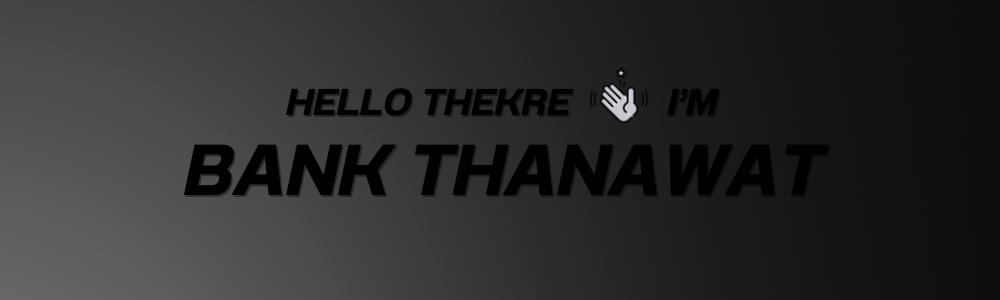

<h2>About me</h2>

&nbsp;&nbsp;&nbsp;**Hi!** I am a Front-End Developer with experience in designing, developing and enhancing web applications, with a strong aspiration to grow into a Full-Stack Developer in the near future.
<ul>
 <li>🎓 <b>I'm graduated</b>: Computer Engineering at the University of Kasetsart Sriracha Campus.</li>
 <!--  <li>🔭 <b>I'm looking for a job</b>: Front-End or Full-Stack Developer. 
 Please have a look at my [RESUME]() for more details about me. -->
 </li>
 <li>🌱 <b>I’m currently learning</b>:
  <ul>
   <li> Nuxt </li>
   <li> Unity </li>
  </ul>
 </li>
 <!-- <li>⚡ <b>Fun fact</b>: 🎵 I love to listen to music, 🎤 sing a song and 🧩 building models.</li> -->
 <li>🕹️ <b>My games</b>: 🔫 <a href ="https://play.unity.com/mg/fps/gbfpseekk">FPS The Gates</a> 🏎️ <a href ="https://play.unity.com/mg/karting/heaven-kart">Heaven kart</a> 🏃‍♂️ <a href ="https://play.unity.com/mg/2d/yeah-mowp">2D Yeah</a></li>
 <!-- <li>📫 <b>How to reach me</b>: You can shoot me an email at <a href ="mailto: thanawat.wangk@gmail.com">thanawat.wangk@gmail.com</a> or catch and follow me from the below links 👇</li> -->
</ul>

<!-- <h2>My micro games</h2>

 <ul>
  <li>🏃‍♂️ <a href ="https://play.unity.com/mg/2d/yeah-mowp">2D Yeah</a></li>
  <li>🏎️ <a href ="https://play.unity.com/mg/karting/heaven-kart">Heaven kart</a></li>
  <li>🔫 <a href ="https://play.unity.com/mg/fps/gbfpseekk">FPS The Gates</a></li>
 </ul>

 -->

<!-- <h2>Connect with me</h2>

 
  &nbsp;
 

  -->

<!--  <h2 align="center">✨ Skills ✨</h2>
<h2 align="center">🛠️ Languages and Tools 🛠️</h2>
<ul>
 <li>🎓 <b>Programming Language</b>: Computer Engineering at the University of Kasetsart Sriracha Campus.</li>
 <li>🔭 <b>Library/Framework</b>: Front-End or Full-Stack Developer.</li>
 <li>🔭 <b>Database</b>: Front-End or Full-Stack Developer.</li>
 <li>🔭 <b>Tools</b>: Front-End or Full-Stack Developer.</li>
 <li>⚡ <b>Others</b>: 🎵 I love to listen to music, 🎤 sing a song and 🧩 building models.</li>
 <li>🌱 <b>Interests</b>:
  <ul>
   <li> Nuxt </li>
   <li> Typescript </li>
  </ul>
 </li>
 </ul>  

<h2 align="center">📚 GitHub Stats 📚</h2>

 
 &nbsp;
 

  -->

<!--
**thanawangk/thanawangk** is a ✨ _special_ ✨ repository because its `README.md` (this file) appears on your GitHub profile.

Here are some ideas to get you started:

- 🔭 I’m currently working on ...
- 🌱 I’m currently learning ...
- 👯 I’m looking to collaborate on ...
- 🤔 I’m looking for help with ...
- 💬 Ask me about ...
- 📫 How to reach me: ...
- 😄 Pronouns: ...
- ⚡ Fun fact: ...
-->
