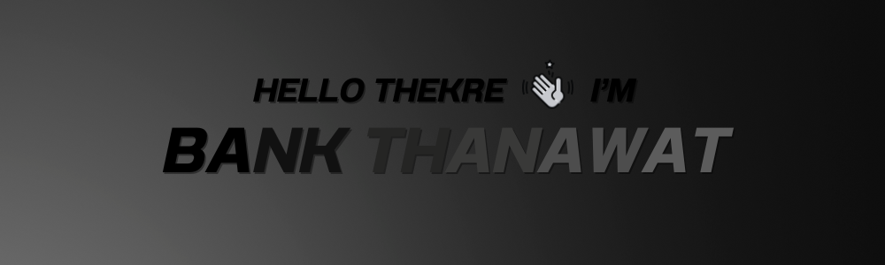

## About me

    **I'm** a passionate Frontend Developer from Thailand who loves crafting intuitive and beautiful digital experiences.

<ul>
 <li>🎓 <b>I'm graduated</b>: Computer Engineering at the University of Kasetsart Sriracha Campus.</li>
 
 <!--  <li>🔭 <b> I’m currently working on</b>: Front-End or Full-Stack Developer. 
 Please have a look at my [RESUME]() for more details about me.
 </li>
 <li>👨‍💻 All of my projects are available at https://santosfrancisco.github.io</li>
 <li>🌱 <b>I’m currently learning</b>:
  <ul>
   <li> Nuxt </li>
   <li> Unity </li>
  </ul>
 </li>  -->
 <!--  <li>⚡ <b>Fun fact</b>: 🎵 I love to listen to music, 🎤 sing a song and 🧩 building models.</li>  -->
 
 <li>🚀 <b>My game projects</b>: 🔫 <a href ="https://play.unity.com/mg/fps/gbfpseekk">FPS The Gates</a> 🏎️ <a href ="https://play.unity.com/mg/karting/heaven-kart">Heaven kart</a> 🏃‍♂️ <a href ="https://play.unity.com/mg/2d/yeah-mowp">2D Yeah</a></li>
 
 <!--  <li>📫 <b>How to reach me</b>: You can shoot me an email at <a href ="mailto: thanawat.wangk@gmail.com">thanawat.wangk@gmail.com</a> or catch and follow me from the below links 👇</li>  -->
</ul>

## Connect with me

 
<!--  &nbsp;
   -->

<!--  <h2 align="center">📚 GitHub Stats 📚</h2>

 
 &nbsp;
 

  -->

<!--  ## Languages and Tools:  -->
